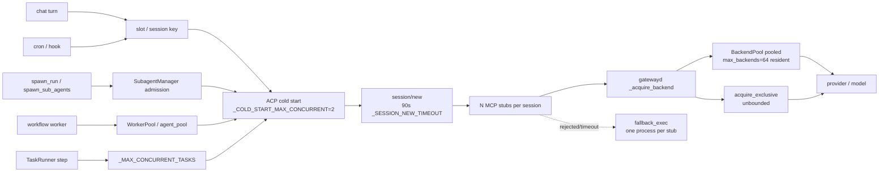

# RFC: Overload resilience — durable task queue, admission before allocation, adaptive concurrency, layered recovery

- Status: accepted (owner decision 2026-09-12 14:21: ONE PR, no design questions
  back). Every design element ships in a single PR on branch
  `fix/gatewayd-overload-liveness`, whose first slice (the gatewayd supervisor no
  longer kills a daemon that is merely busy; the stub reconnect budget rises from
  60s to 600s) is already on the branch and is treated as landed. The supervisor
  half of that slice was solved on `main` by #10455's escalated probe while this
  branch was in review, so this branch's own gate for it is SUBTRACTED rather
  than shipped — see the slice-0 row in §12.
  §12 names the internal waves; §13 records every decision with the
  config flag that reverses it. §14 folds the owner's 2026-09-12 15:12 addendum
  (unified waits, yielding, nested recovery) into the same PR.
- Author: bolichen (Bolin Chen). Requirements: the 2026-09-12 spec
  (`overload-resilience/SPEC.md` in the crew workspace); code investigation
  `subagents/081a6e0a`; GPT-6 review `subagents/99cae534` (verdict REDESIGN, its
  must-fix list is folded into §4, §7 and §9).
- Audited against main `6f056722b`. `origin/main` had not moved when this document
  was written.
- Related: [rfc-durable-run-coordinator.md](rfc-durable-run-coordinator.md) (the
  subagent-only SQLite ledger this RFC generalises across entry points — see §13),
  [rfc-mcp-lifecycle-event-log.md](rfc-mcp-lifecycle-event-log.md),
  [../system-specs/modules/subagent.md](../system-specs/modules/subagent.md),
  [../system-specs/modules/mcp-gateway-daemon-lifecycle.md](../system-specs/modules/mcp-gateway-daemon-lifecycle.md),
  [../system-specs/modules/mcp-gateway-backend-replacement.md](../system-specs/modules/mcp-gateway-backend-replacement.md),
  [../system-specs/modules/taskrunner.md](../system-specs/modules/taskrunner.md),
  [../system-specs/modules/workflows.md](../system-specs/modules/workflows.md),
  [../system-specs/modules/config.md](../system-specs/modules/config.md),
  [../architecture/mcp.md](../architecture/mcp.md).

Line numbers below are written as `L<n>` beside a symbol name and are exact at
`6f056722b`; the symbol is the durable citation, the line is the audit trail.

## 1. Problem and evidence

One goal: accept an unbounded number of tasks, execute a bounded number, keep the
rest as cheap durable rows, shrink concurrency when the host or a provider hurts,
recover from transient failures without a human restarting the Gateway, and never
leave a task showing `running` forever.

Every row of SPEC §一 was re-verified on main. "已复现" means the behaviour was
observed in the incident logs or reproduced by the research harness; "待验证" means
it is read from code and still needs a fault-injected run.

| # | Where (symbol, line at `6f056722b`) | Confirmed behaviour on main | Status | Problem this RFC solves |
|---|---|---|---|---|
| E1 | `config/sections.py` `chat_turn_timeout_secs` L1246 default 14400; `subagent_timeout_secs` L1359 default `SUBAGENT_TIMEOUT_SECS` (10800) | Long-run guards only | 已复现 | Overload control cannot wait hours for a timeout; needs its own signals (§5) |
| E2 | `subagent_manager/admission.py` `check_memory_available` L193, `cached_admission_check` L228, `_should_stagger_queue_impl` L639, `_drain_queue_impl` L651, `_preassigned_id` L121 | In-memory FIFO `_queue` (`subagent.py` L1704), stable queued id, 2s stagger, single drain pump; memory posture check REFUSES before queueing; prevalidated app spawns refuse to queue (L337) | 已复现 (2000-task harness: 10 running / 1990 queued) | No persistent pending work; restart loses the queue; "can we store it" is conflated with "can we start a runtime" (§3, §4) |
| E3 | `subagent.py` `compute_max_subagents` L1030 (floor 3 via `_LEGACY_DEFAULT_MAX`), `apply_limits` L1863 (`max(1, ...)` L1888) | Cap shrinks and in-flight runs drain naturally | 已复现 (manual 10→6→4) | Reuse as the actuator; no controller drives it (§5) |
| E4 | `mcp_gateway/pool.py` `BackendPool.add` L565 `PoolAtCapacity`; `get_or_create` L580; `acquire_exclusive` L788 skips `_max_backends` (L798) | Capacity checked AFTER `spawn()`; exclusive backends unbounded | 已复现 (16 stubs × N sessions storm) | Reserve before allocating; one host budget over pooled + exclusive + fallback (§4) |
| E5 | `mcp_gateway/gatewayd.py` `_acquire_backend` L3375 → `"rejected", "fallback": True` L3056/L3072/L3097; `mcp_gateway/stub.py` `fallback_exec` L1734 called at L1962 (25s `_ENSURE_BACKEND_TIMEOUT_SECS` L95) and L2011 | Scarcity spawns MORE processes per session | 已复现 | Suppress overload-triggered fallback; keep compat/isolation fallback under admission (§4.3) |
| E6 | `mcp_gateway/manager.py` `_LIVENESS_PING_INTERVAL_SECS` 30 L56, `_PING_TIMEOUT_SECS` 2.0 L50 (10s on the branch), `_LIVENESS_MAX_CONSECUTIVE_FAILURES` 3 L64 | Ping failure ⇒ zombie ⇒ kill + respawn | 已复现 (incident: daemon killed while forking) | Separate overload from death using loop lag, pressure, progress (§7) |
| E7 | `mcp_gateway/stub.py` `_RECONNECT_TOTAL_BUDGET_SECS` 60 L85 (600 on the branch); `_reconnect` L1334 replays `initialize`, refuses when live subscriptions cannot be restored | Transport recovery exists; nothing above it resumes the task | 已复现 | Close the loop transport → runtime → task (§7) |
| E8 | `taskrunner.py` `_MAX_CONCURRENT_TASKS` 3 L92, refusal L922/L1482, crash → `paused` L2362; `workflows/registry.py` L234–239 running → `interrupted` failed | Persistent stores exist; excess is refused, restart parks work | 待验证 (restart path read from code) | Cross-entry queue, resume and re-dispatch (§3, §12) |
| E9 | `dashboard/session_health.py` `_PATTERNS` L38 regex over `gateway.log`; `acp/runtime.py` `_session_start_stalled` L3034 | Health is log-scraped; ACP has liveness but no task state | 已复现 | Structured health from task + runtime state (§10) |
| E10 | `mcp_tools/spawn.py` `max_wait` clamp 60..7200 L1048–1051 vs subagent 10800 | Caller wait ends before child budget | 已复现 | Return `still_running` ids, never mark the child failed (§8) |
| E11 | `acp/runtime.py` `_COLD_START_MAX_CONCURRENT` 2 L187, `_SESSION_NEW_TIMEOUT` 90 L255, `create_session` L3214 (`_session_inits_in_flight` diagnostic only L3292); `acp/worker_pool.py` `DEFAULT_MAX_STARTING` 2 L59; `workflows/context.py` `DEFAULT_MAX_AGENTS_PER_RUN` 1000 L33; `subagent_manager/run.py` L798–810 ANY start exception → dedicated process | Per-entry semaphores; a timed-out `session/new` still creates a session remotely and the late reply is dropped (`_pending_requests.pop` L3767) | 已复现 (dedicated-process amplifier in incident) | One host budget across entries; tracked session-start ownership (§4.4) |

`mcp_gateway.max_backends` (`config/sections.py` L4778) defaults to **64** on
main. The 20 seen in incident machines was an explicit local pin and is not a
baseline value.

## 2. Entry points and resource-allocation map



Every limiter that exists today, and its semantics. "Multiply" marks limits that
compose multiplicatively with the row above them.

| Limiter (symbol) | Scope | Default | On exhaustion | Multiplies? |
|---|---|---|---|---|
| `SubagentManager._max_concurrent` (`resolve_max_subagents`) | active subagent runs, gateway-wide | auto (`compute_max_subagents`, floor 3) | queue in memory | base |
| `subagent_spawn_stagger_secs` | subagent starts | 2.0s | queue | — |
| `check_memory_available` / `cached_admission_check` | new subagent spawns | `resource_critical_gb` 2.0 | REFUSE | — |
| `_COLD_START_MAX_CONCURRENT` (`_ColdStartAdmission`) | runtime spawn+`initialize`, per event loop | 2 | wait | — (does not cover `session/new` on an existing runtime) |
| `_SESSION_NEW_TIMEOUT` / `session_start_timeout_secs` | one `session/new` | 90s | `AcpRequestTimeout` → dedicated-process fallback | amplifies ×(1 runtime + N stubs) |
| `WorkerPool._task_sema` / `_start_sema` | workflow / app workers | 5 / 2 | wait | × per pool instance |
| `DEFAULT_MAX_AGENTS_PER_RUN` (`workflows/context.py`) | agents per workflow run | 1000 | refuse | × per run |
| `_MAX_CONCURRENT_TASKS` (`taskrunner.py`) | TaskRunner runs | 3 | REFUSE | × `taskrunner.max_parallel_steps` |
| `session.pool_size` | warm ACP processes | 0 | — | adds residency |
| `BackendPool._max_backends` | pooled RESIDENT backends, daemon-wide | 64 | `PoolAtCapacity` → fallback | none; but `acquire_exclusive` bypasses |
| `acquire_exclusive` | private backends | none | — | × stubs × sessions |
| `CircuitBreaker` (`breaker.py`) | per PoolKey fast-crash loop | 5 deaths <5s in 60s → OPEN 60s | refuse spawn | — |
| `_ENSURE_BACKEND_TIMEOUT_SECS` (stub) | wait for `ready` | 25s | `fallback_exec` | amplifies |
| `_DEFAULT_INITIALIZE_TIMEOUT_SECS` (backend) | MCP `initialize` | 10s | `BackendGone` → respawn once → give-up | — |

Nothing bounds **total processes** or **in-flight spawn+initialize** across the
daemon; nothing bounds **total active executions** across entry points. The
per-entry semaphores compose as sums and products, so "each entry has a limit"
proves nothing about the host.

## 3. Task model

### 3.1 One durable store: `$KIROCREW_HOME/tasks/tasks.db`

Decision: introduce one SQLite store owned by a new package `kiro_crew/taskq/`
(`store.py`, `state.py`, `scheduler.py`, `budget.py`, `controller.py`,
`recovery.py`). TaskRunner `runs.json`, the workflow `RunRegistry`, and subagent
`state.json`/`tombstone.json`/`result.txt` folders stay as **artifact and
evidence stores**, referenced by `result_ref`; they are not the scheduling source
of truth. Rationale: the three existing stores carry three incompatible lifecycle
vocabularies (`paused`, `interrupted`, tombstone classes) and none can express a
cross-entry budget or a lease. WAL mode, `synchronous=NORMAL`, single writer task
in the gateway process, reads from any task. No external service.

### 3.2 Schema (SPEC §二.1 fields)

```sql
CREATE TABLE tasks (
  id TEXT PRIMARY KEY,            -- stable; the subagent id / run id / workflow agent id
  parent_id TEXT,                 -- parent task (subagent parent, workflow run, TaskRunner run)
  root_id TEXT NOT NULL,          -- top of the tree, for fairness lanes
  session_key TEXT NOT NULL,      -- owning session (lane key); "" for cron/hook roots
  kind TEXT NOT NULL,             -- subagent | workflow_agent | taskrunner_step | chat_turn | cron | hook
  harness TEXT NOT NULL,          -- acp backend id (ACP_BACKEND_KIRO ...), never a model id
  provider TEXT,                  -- provider lane for per-provider throttling
  params_json TEXT NOT NULL,      -- full spawn kwargs (the dict shape _queue entries carry today)
  workspace TEXT,
  scope_ref TEXT NOT NULL,        -- {memory_store, allowed_tools, approval_scope, app_owner} reference
  state TEXT NOT NULL,            -- §3.3 vocabulary
  attempts INTEGER NOT NULL DEFAULT 0,
  next_run_at REAL,               -- for retry_wait; NULL = eligible now
  lease_owner TEXT,               -- gateway incarnation id
  lease_expires_at REAL,
  generation INTEGER NOT NULL DEFAULT 0,
  progress_json TEXT,             -- last progress marker, ts, completed steps
  result_ref TEXT,                -- path/URI of result.txt, run folder, workflow result
  deadline_at REAL,               -- optional caller total deadline
  idempotency_key TEXT,           -- caller-supplied; UNIQUE when present
  created_at REAL NOT NULL, updated_at REAL NOT NULL
);
CREATE INDEX tasks_dispatch ON tasks(state, next_run_at, root_id);
CREATE TABLE task_events (task_id TEXT, seq INTEGER, ts REAL, kind TEXT, data_json TEXT,
  PRIMARY KEY(task_id, seq));
CREATE TABLE meta (key TEXT PRIMARY KEY, value TEXT);  -- schema_version, incarnation
```

`task_events` is append-only and is the source for §10 "recent progress" and
"retry count"; it uses the envelope shape of `kiro_crew.events` so it can later be
projected into the append-only ledger without a second writer.

### 3.3 State machine

```text
queued ──admit──▶ admitted ──start──▶ starting ──first stream event──▶ running
  ▲                 │                   │ start failed (infra)            │
  │                 │ budget lost       ▼                                 ├─▶ waiting_children
  │                 └────────────▶ waiting_infra ◀────────────────────────┤     (spawn_sub_agents)
  │                                    │  backoff                         ├─▶ waiting_permission
  └──── retry_wait ◀───────────────────┘                                  │     (approval pending)
        (next_run_at)                                                     ├─▶ recovering
                                                                          │     (transport/runtime rebuild)
 terminal: done | failed | cancelled | unknown_side_effect                └─▶ terminal
```

| State | Meaning | Budgets running (§8) | Holds |
|---|---|---|---|
| `queued` | durable row, no resources | queue wait only | nothing |
| `admitted` | claimed by scheduler, lane slot + host budget reserved | start | slot, budget |
| `starting` | session-start gate held, `session/new` outstanding | start | slot, budget, start gate |
| `running` | ≥1 stream event seen | execution, no-progress | slot, budget |
| `waiting_children` | parent blocked in `spawn_sub_agents` | total deadline only | budget (residency), NOT slot |
| `waiting_permission` | approval pending (§14 W5) | total deadline only | budget (residency), NOT slot |
| `waiting_input` | tool or command needs real user input (§14 W4) | total deadline only | budget (residency), NOT slot |
| `waiting_dependency` | external dependency unavailable or rate-limited; wake by `DependencySignal` or `retry_at` (§14 W2) | recovery wait | budget (residency) while the runtime is kept, else nothing |
| `waiting_infra` | admission deferred (memory posture, gate closed, dependency down) | recovery wait | nothing new |
| `retry_wait` | transient failure, `next_run_at` set | recovery wait | nothing |
| `recovering` | transport/runtime being rebuilt for this task | recovery wait | slot, budget |
| `done` / `failed` / `cancelled` | terminal (`done` is the addendum's `succeeded`; it may carry `partial=true`) | — | — |
| `unknown_side_effect` | terminal-pending: an external operation may have happened, reconcile needed (§9) | — | — |

Every `waiting_*` and `retry_wait` row carries a `WaitRecord` (§14.1). Terminal
states never regress. `cancelled` beats every other transition
(§9.5). Existing readers map: subagent `tombstone.json` classes → `done`/`failed`/`cancelled`;
TaskRunner `paused` after crash → `retry_wait` with `attempts+1`; workflow
`interrupted` → `retry_wait` when the run's remaining agents are re-dispatchable,
else `failed`.

### 3.4 Write-before-ack

`spawn_run`, `spawn_sub_agents`, `task_run`, `workflow_run`, cron and hook
dispatch each call `TaskStore.accept(batch)` and receive ids only after
`COMMIT`. A failed write (disk full, locked >2s, schema mismatch) raises
`TaskStoreUnavailable`, which the MCP tool surfaces as a typed refusal — never an
accepted id. Items are stored one row each; no batch summarisation. The memory
posture check (`cached_admission_check`) moves from before-queue to
before-`admitted`: pressure defers, it no longer refuses (GPT-6 must-fix 5).
Approval, deny-rule and governance checks stay where they are (before accept).

### 3.5 Bounded dispatch window

The scheduler keeps at most `agent.task_dispatch_window` (default 64) rows in
memory: the `admitted`/`starting`/`running` set plus a prefetch of eligible
`queued` rows ordered by the fairness policy (§6). 2000 accepted tasks are 2000
rows and ~64 Python objects.

### 3.6 Compatibility with existing records

On first start with the store enabled, `taskq.migrate` imports: non-tombstoned subagent
folders (today's orphan recovery input) → `retry_wait` or `failed` per the
existing PID/result inference; TaskRunner `runs.json` `paused`/`planned` runs →
`queued` only when `taskrunner.auto_resume` (new, default false) is set, else
left as today; workflow `RunRegistry` running → `retry_wait` only for runs whose
plan is replayable from cached results (`workflow_rerun_subtree` semantics),
else `failed` as today. The import is idempotent (keyed on id) and runs before
the scheduler starts. Old files are not deleted; `result_ref` points at them.

## 4. Admission before allocation

### 4.1 One host budget

`HostBudget` (gateway process, `taskq/budget.py`) holds three counters with
ceilings: `procs` (expected OS processes), `rss_mb`, `fds`. Ceilings derive from
`compute_max_subagents`' inputs (`subagent_memory_mb`, available memory, CPU) and
from `resource.getrlimit(RLIMIT_NOFILE)` via `platform_compat`. Every executor
charges an **estimate** at `admitted` and true-ups from the periodic `resource_status`
sample: a shared-runtime session costs (0 procs, `session_rss_mb`, k fds); a
dedicated runtime costs (1 + expected stub count, `runtime_rss_mb`, ...); each
gatewayd backend the session will need costs (1, `backend_rss_mb`, 3). Pooled,
exclusive and fallback backends charge identically — exclusivity is a topology
property, not a budget exemption. Idle resident sessions are charged until the
existing idle reclaim (`session.timeout_secs`) releases them; the budget reads
the reclaim, it does not add one.

### 4.2 gatewayd global spawn gate and `queued` keepalive

`mcp_gateway/admission.py` `SpawnGate` (daemon-wide, single instance built in
`run_gatewayd` beside `BackendPool`): AIMD capacity with `initial/min/max` =
`4/1/8`, FIFO deque of waiters, `Permit` with idempotent `settle(outcome)` and
`release()` as **separate** operations (GPT-6 hazard 5). Acquisition happens
inside the `_spawn` closure of `_acquire_backend`, AFTER the per-key
`_spawn_locks` dedup and AFTER `CircuitBreaker.allow` (never hold a permit during
breaker cooldown, never hold `pool._lock` while queued). Resident capacity is
checked BEFORE the permit is taken: `BackendPool.reserve()` (new) decrements a
resident slot or raises `PoolAtCapacity` before `spawn()`, replacing the
post-spawn `add()` check (GPT-6 must-fix 4).

Permit lifecycle: the permit covers spawn **and** the active `initialize`
window. Because `ready` is sent before `initialize` arrives (the stub forwards
kiro-cli's first frame), the permit is released by whichever comes first:
`_init_done_event` **plus** the process being reaped, or `initialize_timeout_secs`
after `ready` when no `initialize` was forwarded (counted as **neutral**, not
failure — an unused prewarm or a client that never initialised is not
congestion). A backend killed for init timeout stays charged to `HostBudget`
until `Backend.shutdown` confirms the process is gone (the SIGKILL-survivor case).

Protocol: `REGISTERED_CAPABILITIES` gains `"spawn_queue"`. A stub that
advertises it sends `{"type":"ensure_backend","wait_budget_secs":N}`; the daemon
then emits `{"type":"queued","position":p,"capacity":c,"eta_secs":e}` every 5s
while waiting. A stub without the capability never sees `queued`: it gets the
≤25s legacy behaviour, so old stubs keep working during a rolling upgrade. The
stub's wait is a **silence timer** (reset on `queued`, `keepalive`, `pong`),
bounded by the 600s total budget; those control frames are consumed, never
forwarded to kiro-cli. Bridge pings continue to be answered from the connection's
read loop while a spawn waits, by moving the wait off the sequential reader into
a per-connection task (GPT-6 hazard 8). The same negotiation applies to
`_reconnect` (`stub.py`) and to `_respawn_backend_for_stub`, so all three stub
paths are queue-aware (GPT-6 must-fix 3). Daemon drain closes the gate first,
cancels queued futures and watcher tasks, then proceeds with today's teardown.

### 4.3 Fallback classification

`rejected` frames carry `class`: `capacity`, `pressure`, `compat`, `isolation`,
`breaker`. The stub runs `fallback_exec` only for `compat` (target cannot be
pooled) and `isolation` (declared private topology that the daemon refuses);
`capacity`/`pressure`/`breaker` surface as a JSON-RPC error to kiro-cli with
`retry_after_secs`, and the owning task moves to `waiting_infra` (§7). An
`isolation` fallback still charges `HostBudget` through the stub's
`fallback_exec` report on its registration line, so it is admitted, not free.
Old daemons emit no `class`; a new stub treats a missing `class` as `compat`
(today's behaviour) — the compatibility floor cannot provide the new guarantee
and the RFC does not claim it does.

The mirror direction is where the guarantee has a price, and it is paid rather
than waived: an old STUB cannot act on `class` either, so `fallback: true` is the
only thing it would read, and giving it to a `capacity` refusal hands the
unbounded exec back at exactly the moment the host cannot carry it — worse than
untagged, because that stub closes its socket before exec'ing, so the
`HostBudget` charge is released before the process exists and N concurrent
refusals escape accounting entirely. `capacity` therefore carries no `fallback`
on any wire shape, and an old stub that is still waiting takes its terminal exit:
kiro-cli reports that one server as failed for that one session, recorded as a
`terminal:` line in `stub_fallback.jsonl`. A refusal that arrives after the
pre-upgrade stub's own 25 s pre-flight window is exec'd anyway on a path that
reads no frame — see [mcp.md](../architecture/mcp.md) for the bound that keeps the
daemon inside it and the residual that survives. Losing one session's tool surface is accepted to keep the
host bound; `compat`/`isolation` keep the tag, so a target-shaped refusal still
degrades to a per-session exec on every stub version.

### 4.4 Session-start gate with tracked ownership

`SessionStartGate` (gateway process, `taskq/scheduler.py`): fixed semaphore
`agent.session_start_concurrency` (default 2, separate from
`_COLD_START_MAX_CONCURRENT`, which stays for runtime spawn+`initialize`).
Acquired after `HostBudget`, before `AcpRuntime.create_session`. The gate is
**not** adaptive — the adaptive loop is the gatewayd `SpawnGate` plus the
execution-cap controller (§5); two adapting loops on the same resource oscillate
(GPT-6 §5).

Ownership: a start attempt is `task_events(kind="start_attempt", data={gen,
session_key?})` written before `session/new` is sent. On `AcpRequestTimeout` the
task does **not** re-queue. It moves to `recovering`; the attempt stays owned by
a detached `StartCollector` that keeps the `req_id` registered
(`_pending_requests` must expose `adopt(req_id)` rather than `pop`) and either
(a) receives the late `session/new` result — then the collector closes that
session through the runtime's normal session teardown unless the task is still
in `recovering` with no newer attempt, in which case the session is adopted and
the task resumes `starting` under the same generation; or (b) observes the
runtime die, and releases the budget. No second `session/new` is issued for the
task until the collector settles or a `start_collect_timeout_secs` (default 300)
cleanup deadline passes, after which the attempt is recorded `abandoned` and the
task goes to `retry_wait` with backoff. A `session/new` timeout **never** falls
back to a dedicated process for congestion; the dedicated path remains only for
explicit `model`/`allowed_tools`/privacy overrides, and it goes through the same
gate and budget.

### 4.5 Acquisition order and deadlock argument

Order, always: (1) `TaskStore.claim` (lease) → (2) lane execution slot
(`SubagentManager._max_concurrent` or the entry's counterpart, via the shared
`ExecutionCap`) → (3) `HostBudget.reserve` → (4) `SessionStartGate` → (5)
gatewayd `SpawnGate` (in the daemon, per backend, after `_spawn_locks` and
breaker) → (6) `BackendPool.reserve`. Release strictly in reverse. Invariant: a
holder of resource k only ever waits for resource k+1, so the wait-for graph is
acyclic. Waits at steps 2–4 are bounded by `admit_wait_secs` (default 30); on
expiry the task returns to `queued` releasing everything, so a stuck downstream
never pins upstream slots. Prewarm (`prewarm_from_payloads`) is a step-5 client
with priority BELOW every stub: it is skipped entirely while the controller is in
`pressure` or `paused` (GPT-6 hazard 3). Exclusive backends take steps 5–6 like
pooled ones; step 6 for them decrements a separate `exclusive_reserved` counter so
they remain exclusive but counted.

### 4.6 Release paths

Every reservation is released exactly once by a `ReservationSet` whose
`release()` is idempotent and is called from: normal completion; `cancel_impl`
(after `_schedule_cancel_recovery_impl` finishes teardown — today's ordering in
`cancellation.py` is kept); any exception in `_run_impl`; `StartCollector`
settlement for late callbacks; lease expiry detected by the reconciler (the
lease owner is the same process, so this is a self-check on crashed tasks); and
gateway shutdown (release-all, rows stay `admitted`/`starting` and are reset to
`queued` by the incarnation check on next boot).

## 5. Adaptive controller

### 5.1 Signals

Sampled every `controller_sample_secs` (5s) into a ring of 60:

| Signal | Source | Scope |
|---|---|---|
| event-loop lag | `asyncio` heartbeat delta in gateway and in gatewayd (reported in the `stats` frame) | host |
| RSS / available memory | `resource_status._read_available_gb`, process RSS via `platform_compat` | host |
| fd / proc count | `HostBudget` true-up | host |
| start latency | `session/new` and backend `initialize` durations (p50/p95) | host |
| attributable timeout rate | `AcpRequestTimeout` on start, backend init timeout, stall — excludes permission/argument/context errors | host |
| provider 429 / throttle | typed provider errors surfaced by the ACP stream | per provider |
| completion rate | `done` per window vs `admitted` per window | host |

Classification (`errors.py` conventions): permission denied, invalid params,
context-length, deny-rule and governance refusals are `non_congestion` and never
feed the controller.

### 5.2 Two actuators, one policy object

`AdaptivePolicy` (shared dataclass, used by both loops):

| Parameter | gatewayd `SpawnGate` | gateway `ExecutionCap` |
|---|---|---|
| initial / floor / ceiling | 4 / 1 / 8 | `min(user_max, 4)` / 1 / `user_max` |
| decrease | ×0.5 floor 1 on **corroborated** pressure (host signal + ≥2 distinct keys slow/failing, or ENOMEM/EAGAIN) | ×0.5 floor 1 |
| increase | +1 after ≥20 successful inits AND ≥30s without pressure AND demand at the limit | +1 after ≥`increase_window_secs` (60) clean, demand at limit |
| cooldown after decrease | 30s; pre-decrease successes discarded | 60s |
| hysteresis | decrease at lag ≥ 250ms or mem ≤ `resource_critical_gb`; increase only below 100ms and ≥ `resource_pressure_gb` | same thresholds |
| pause | mem ≤ critical for 2 samples, or dependency (gatewayd/provider) down | stop admitting; keep running work |
| probe after pause | admit 1 task; require it to reach `running` before capacity returns to floor+1 | same |

The gateway actuator is `SubagentManager.apply_limits(cfg, max_concurrent=effective)`
(existing) plus equivalent hooks on `TaskRunner` and the workflow `WorkerPool`;
`effective ≤ user max` always, and `apply_limits` never writes `config.json` — the
user's value stays the ceiling. On a fresh gateway start `effective` begins at
`min(user_max, 4)` and earns its way up (no full concurrency until work completes).
Per-provider 429s multiply only that provider's lane share (§6), never the host
cap.

Thresholds above are starting values; the in-repo fault-injection harness (§11,
wave E) fixes them and the spec records the measured numbers.

## 6. Fairness

- **Lanes.** One lane per `root_id`'s `session_key`. Within a lane, FIFO by
  `created_at` (preserves same-session ordering). Across lanes, deficit round
  robin with equal quantum, so a 2000-task batch from one session cannot starve
  a 3-task session; a lane with `retry_wait` rows only is skipped.
- **Reserved capacity.** `ExecutionCap` reserves 1 slot for interactive chat
  turns and never charges control-plane work (cancel, status, health, reconcile)
  against any budget; those paths read the store and the in-memory window only.
- **Parent waiting on children.** A parent entering `spawn_sub_agents` (or a
  workflow `parallel` barrier) transitions to `waiting_children` and **releases
  its execution slot** while keeping its residency charge (the kiro-cli process
  is idle in a tool call, but resident). Children are dispatched from the
  parent's lane with a `child_reserve` of 1 slot that only depth>0 tasks may
  take, so a fleet of parents can never hold every slot. If residency budget is
  exhausted by waiting parents, the scheduler applies checkpoint-pause: for a
  dedicated-runtime parent, close its runtime and mark the parent
  `waiting_children{resumable=true}`; on children completion the parent resumes
  via the existing continuable-session path (`spawn_continue` semantics). Shared-
  runtime parents cost a session handle, not a process, and are not paused. No
  counter is decremented without the corresponding resource actually being idle
  or released.

## 7. Recovery ladder

Shared `RecoveryPolicy`: exponential backoff base 2s, cap 120s, equal jitter,
per-layer attempt caps, escalation only when the lower layer exhausted its cap.
Each layer records `task_events(kind="recover", layer=...)`.

| Layer | Trigger | Cleanup deadline | Attempts before escalation | Action |
|---|---|---|---|---|
| L1 tool call | JSON-RPC error classed `recoverable_infra` (backend gone, queued timeout) | — | 3 | re-issue the MCP call through the stub; task stays `running` |
| L2 backend | `BackendGone`, init timeout, breaker OPEN | `Backend.shutdown` budget (existing 10+5+2s) | 2 respawns per key | `_respawn_backend_for_stub` under `SpawnGate`; replay captured `initialize`, restore subscriptions; on capability change → L3 |
| L3 ACP runtime | `AcpRuntimeDead`, stall > `subagent_stall_idle_secs`, `session/new` collector abandoned | shutdown budget + process-tree kill via `platform_compat` | 2 | rebuild runtime, `session/load` the task's session if continuable else restart attempt with `generation+1`; task `recovering` |
| L4 gatewayd | supervisor: liveness ping fails 3× AND (loop lag from `stats` unavailable or > 5s) AND no backend progress for 60s | daemon drain | 1 per 10 min | respawn daemon; stubs reconnect within 600s; tasks whose stubs cannot reconnect → L3 |
| L5 gateway | none automatic | — | — | logged escalation event + `send_notification`; the user restarts. Automatic gateway restart is out of scope. |

Overload never enters the ladder: pressure pauses admission and lowers caps
(§5); only a unit that has stopped making progress **and** fails an independent
probe (ping for the daemon, `session/prompt` heartbeat for a runtime, `initialize`
replay for a backend) is terminated. Progress evidence outranks liveness evidence:
`is_serving=true`, a live PID or an open TCP socket alone never prevent
termination, and business progress alone (recent stream event) always prevents it.
L2 handles initialize-consumed-then-lost correctly: a stub with a captured
`initialize` re-primes the new backend; it never `fallback_exec`s an
uninitialised one (`respawn give-up (no captured initialize)` stays a give-up,
now classed `compat`).

## 8. Time budgets

| Budget | Runs during | Default | Source |
|---|---|---|---|
| queue wait | `queued`, `waiting_infra`, `retry_wait` | unbounded unless `deadline_at` | caller |
| admit wait | `admitted` waiting on steps 2–4 | 30s → back to `queued` | `agent.admit_wait_secs` |
| start | `starting`, active only | 90s | `session_start_timeout_secs` |
| start collect | `recovering` after start timeout | 300s | `agent.start_collect_timeout_secs` |
| execution | `running` | 10800s subagent, 14400s chat turn | existing keys; clock starts at first stream event, not at accept |
| no-progress | `running` | `subagent_stall_idle_secs` | existing |
| recovery wait | `recovering`, per layer | ladder caps (§7) | `RecoveryPolicy` |
| total deadline | all non-terminal | none | caller `deadline_at` |

The startup watchdog (`_STARTUP_TIMEOUT_SECS` 120, keyed on `_exec_started`) and
the wall-clock reaper in `monitoring.py` both read `started_at` from the store's
`running` transition, so queue and admit time never trigger them (GPT-6 §4).

`spawn_sub_agents` keeps its 60..7200s wait clamp. On expiry it returns
`{"status":"still_running","ids":[...],"states":{...},"poll":"spawn_status"}`;
the children keep their 10800s budget, are not cancelled, and their completion
events still arrive. A parent chat turn hitting `chat_turn_timeout_secs` leaves
its children in the store untouched; results are delivered to the parent session
by id when it next runs (§10).

## 9. Exactly-once boundaries

1. **Atomic claim.** `UPDATE tasks SET state='admitted', lease_owner=?,
   lease_expires_at=?, generation=generation+1 WHERE id=? AND state IN
   ('queued','retry_wait') AND (next_run_at IS NULL OR next_run_at<=?)`; zero
   rows affected means someone else has it.
2. **Lease.** 60s, renewed by the run loop every 20s; a lease that lapses in the
   same process is a bug surfaced by the reconciler, not a takeover.
3. **Generation fencing.** Every callback (`_claim_finalize`, `_release_slot`,
   stream events, `StartCollector`) carries the generation it started with; the
   store rejects writes whose generation is stale, so a late worker from
   generation n cannot overwrite n+1's result or release n+1's reservation.
4. **Stale results.** Rejected writes are appended to `task_events` as
   `stale_result` for diagnosis; the parent is never notified twice for one id
   (`settle_queued_delivery` ordering kept).
5. **Cancel vs restart.** `cancelled` is written first, then teardown. Recovery
   and dispatch re-read `state` after acquiring the lease and abort on
   `cancelled`. Restart never resurrects a cancelled row; a cancel arriving
   during `recovering` wins.
6. **Idempotency classes.** `params_json.side_effect_class ∈ {none,
   idempotent_key, unknown}`. `none` and `idempotent_key` retry freely
   (the key is forwarded); `unknown` on a lost response goes to
   `unknown_side_effect` and the reconciler asks the entry adapter to query
   (e.g. `gh api` for a PR the task was creating). No blind replay of send/pay/
   submit; no exactly-once promise for arbitrary external operations.
7. **Reconcile-first.** Boot: incarnation id changes → every `admitted`/
   `starting`/`running`/`recovering` row of the old incarnation is examined:
   result artifact present → `done`; tombstone → mapped terminal; else
   `retry_wait` (attempts+1) or `unknown_side_effect` per class.
8. **Auth re-validation.** At dispatch and at every recovery the adapter re-runs
   the checks that produced `scope_ref`: agent existence/ownership
   (`_agent_prevalidated` becomes "prevalidated at accept, revalidated at
   admit", so app spawns may queue), memory store binding, allowed tools,
   approval scope. Failure → `failed{reason=auth_stale}`, never a silent
   downgrade. TaskRunner's clearing of transient auto-approve on restart is kept;
   a persisted `auto_approve=true` is never restored.

## 10. Visibility

- **API.** `GET /api/tasks?state=&session=` (paged, from the store);
  `GET /api/tasks/{id}` with `task_events` tail; existing `spawn_list`,
  `spawn_status`, `/api/workflows/runs`, TaskRunner status map their vocabularies
  onto §3.3 via one `to_public_state()`.
- **UI.** Sub-agents panel and Workflows tab show `queued (position)`,
  `waiting: children / permission / infra`, `retry in Ns (attempt k)`,
  `recovering (layer)`; the resources popover shows effective concurrency vs user
  max and the current pressure reason.
- **Health.** `session_health.py` reads task + runtime state instead of scraping
  `gateway.log`; the regex path remains only as a fallback for pre-migration
  logs. `kirocrew doctor` prints queue depth, oldest wait, effective caps,
  pressure reason.
- **Metrics** (bounded cardinality; labels are enums, never ids):
  `taskq_depth{state}`, `taskq_oldest_wait_secs`, `taskq_completion_rate`,
  `taskq_effective_cap{lane_kind}`, `taskq_pressure_reason{reason}`,
  `host_procs_peak`, `host_fds_peak`, `host_rss_peak_mb`, `loop_lag_ms{process}`,
  `recovery_duration_secs{layer}`, `restarts_total{layer}`,
  `spawn_gate_capacity`, `spawn_gate_queued`, `spawn_gate_wait_p95_ms`.
  SEL audit rows `taskq.cap-decreased`, `taskq.paused`, `mcp-gateway.spawn-gate-halved`.

## 11. Test plan

Unit tests use a fake harness (`test/fake_pool_mcp_server.py`, a fake
`LLMProvider`, `freezegun`-style controlled clock via the existing monotonic
injection), never a real `kiro-cli`. Transport tests that open `AF_UNIX` sockets
fail with `PermissionError: EPERM` in the sandboxed research environment (3 of
103 baseline tests); they are marked `xdist_group("af_unix")` and must be run in
an environment that permits sockets — a skip there is recorded, not reported as
pass, and is not a product defect.

| SPEC §四 scenario | Test file (new or extended) | Assertion |
|---|---|---|
| 2000-task burst | `test_subagent_scale.py` (extend), new `test_taskq_scale.py` | 2000 rows committed before any id returned; peak objects ≤ window; runtimes ≤ effective cap; 2000 unique `done`, depth 0 |
| automatic down-scaling | new `test_taskq_controller.py`; `test_subagent_config_hot_reload.py` (extend) | injected start latency / lag → `effective` halves without any `apply_limits` call from the test; `apply_limits` clamps `effective ≤ user max` |
| recovery up-scaling | `test_taskq_controller.py` | pressure removed → +1 per window, no oscillation across 10 windows at threshold ±5% |
| cross-process restart | new `test_taskq_restart.py`, `test_workflows_resilience.py` (extend), `test_taskrunner.py` (extend) | crash injected at `queued`, `running`, result-written-not-acked → rows survive, terminal never regresses, resumable rows reach `done` |
| outage longer than old stub budget | `test_stub_broker_reconnect.py` (extend), `test_mcp_gateway_wedge_ping_gate.py` (extend) | 300s daemon absence → reconnect, bounded fds/buffer, attempt rate ≤ policy |
| mixed entry points | new `test_taskq_cross_entry.py` | chat + subagent + workflow + TaskRunner concurrently: `HostBudget.procs` never exceeds ceiling |
| parent-child progress | `test_admission_gate.py` (extend) | N parents all `waiting_children` → children progress via `child_reserve`; residency accounted |
| cancel and races | `test_subagent.py` (extend), new `test_taskq_fencing.py` | queued/running/restart-time cancel, late callback, duplicate completion → no resurrection, reservations balanced |
| side effects and identity | `test_taskq_fencing.py` | lost response with class `unknown` → `unknown_side_effect`; scope re-validation failure → `failed{auth_stale}` |
| state and time | `test_taskq_budgets.py` | 1h queue leaves execution budget intact; `waiting_permission` not reaped; dead runtime detected within ladder bound |
| storage failure | `test_taskq_store.py` | injected write failure → `TaskStoreUnavailable`, no id; corrupt row → quarantined, siblings dispatch |
| user operations under load | `test_session_health.py` (extend), `test_resource_status.py` (extend) | status/cancel/health respond < 1s with window full |
| gatewayd gate | `test_mcp_gateway_pool_integ.py`, `test_mcp_gateway_exclusive_backend.py`, `test_mcp_gateway_stub_admission_fallback.py`, new `test_mcp_gateway_spawn_gate.py` (mirror `test_mcp_gateway_breaker.py`) | 30 private stubs, cap 4 → all `ready`, no fallback record, in-flight ≤ cap; permit settle idempotent; cancel at each boundary; unused prewarm neutral; old stub never sees `queued`; drain cancels waiters |

Addendum scenarios (SPEC-ADDENDUM §10), all on the real scheduler and event
paths with a fake dependency, fake harness and injected clock:

| Addendum scenario | Test file | Assertion |
|---|---|---|
| ≥3-level parent/child, leaf waits, unrelated tasks keep completing | new `test_taskq_nested_wait.py` | S→A→B chain in `waiting_children` / `waiting_dependency`; a fourth root reaches `done` meanwhile |
| all slots held by parents waiting on children, system still advances | `test_admission_gate.py` (extend) | parents yield the lane slot; `child_reserve` admits a child; no deadlock within N ticks |
| many sessions hit the same dependency throttle | new `test_taskq_dependency_coordinator.py` | one `DependencyCoordinator` schedule per scope; ≤ 1 retry per `retry_at` window across sessions |
| fault isolation between dependencies | `test_taskq_dependency_coordinator.py` | scope A throttled, scope B waiters admitted; host cap unchanged |
| bounded procs/FD/connections/memory while waiting | `test_taskq_nested_wait.py`, `test_mcp_gateway_pool_integ.py` (extend) | `HostBudget` residency never exceeds the ceiling; no new runtime per wait |
| gradual wake on dependency recovery | `test_taskq_dependency_coordinator.py` | recovery signal wakes waiters through admission at ≤ `effective` per tick, never all at once |
| unexpected interactive command recovers at a safe boundary; real input wait is shown | new `test_tool_interactive_policy.py`, `test_session_health.py` (extend) | pager/stdin block → `waiting_input` with `WaitRecord.reason`; no auto-yes; no replay of a side-effecting command |
| long silent task not killed | existing liveness oracle tests (extend) | matched shell child with no output for 40 min → `WORKING`; task stays `running` |
| closed-box tool truly wedged → bounded, partial result kept | `test_tool_interactive_policy.py` | `UNKNOWN` past budget → that call cancelled, partial output in `progress_json`, task `recovering` |
| `EVENT_COMPLETE` + `error: tool stall` not recorded as success | new `test_subagent_stop_reason_consistency.py` (wave N, lands first) | real `run.py` event path; completion with `STOP_REASON_TOOL_STALL` → `recovering`, never `done` |
| blocking wait timeout loses nothing, duplicates nothing | `test_subagent.py` (extend the `spawn_sub_agents` path) | `still_running` ids returned; same rows continue; completion delivered once |
| gateway restart during a wait | `test_taskq_restart.py` | `WaitRecord`, parent links and `resume_condition` rebuilt from the store; wake fires after restart |
| cancel + restart + late result + lease expiry concurrently | `test_taskq_fencing.py` | no resurrection, no duplicate execution, reservations balanced |
| native subagent without fine-grained control: declared boundary holds | new `test_native_subagent_boundary.py` | `_kiro.dev/subagent/list_update` cards counted under the parent task; recovery boundary is the parent session; degradation declared |

**2000-task burst** is a test, not a script:
`test_taskq_admission_integration.py::test_2000_submissions_all_complete_window_never_exceeds_64`
(real admission and store, fake harness) pins that every submission completes
once and the dispatch window never exceeds 64. The two defects a wider
fake-harness run found during development (D1, D2 below) are each pinned by an
owner test; the run itself and its report do not ship.

### 11.1 Acceptance matrix -- landed tests (wave J)

Every scenario above maps to a test that exists on the branch. Owner tests carry
the behavioural proof; `test_overload_acceptance.py` is the map (one test per
scenario, docstring naming the owners, a smoke assertion through the public
API).

| Scenario | Test(s) |
|---|---|
| 2000-task burst | `test_taskq_admission_integration.py::test_2000_submissions_all_complete_window_never_exceeds_64` |
| automatic down-scaling | `test_adaptive_policy.py`; defect D1 pinned by `test_overload_acceptance.py::test_d1_two_lifetime_gate_failures_must_not_pin_the_cap_forever` and `::test_spawn_gate_windowed_failures_let_the_cap_recover` |
| recovery up-scaling | `test_overload_acceptance.py::test_spawn_gate_windowed_failures_let_the_cap_recover`; defect D1 pinned by `test_d1_two_lifetime_gate_failures_must_not_pin_the_cap_forever` (strict xfail) |
| cross-process restart | `test_taskq_reconcile.py`, `test_taskq_admission_integration.py::test_queued_rows_survive_restart_and_redispatch`, `test_overload_acceptance.py::test_a12_gateway_restart_during_a_wait_rebuilds_identity_and_links` |
| outage longer than the old stub budget | `test_stub_broker_reconnect.py`, `test_overload_acceptance.py::test_i12_many_waiting_tasks_and_normal_tasks_coexist_bounded`; defect D2 pinned by `test_dependency_coordinator.py::test_infra_scope_survives_more_probes_than_max_attempts` and `test_overload_acceptance.py::test_d2_gatewayd_outage_longer_than_a_minute_must_not_fail_the_scope` |
| mixed entry points | `test_taskq_runner_adapter.py`, `test_taskrunner_taskq.py`, `test_workflows_agent_pool.py` (runner lanes bounded by the one effective cap) |
| parent-child progress | `test_taskq_nested_propagation.py`, `test_fairness_lanes.py::test_child_reserve_three_level_tree_at_cap_2`, `test_overload_acceptance.py::test_a01_three_level_tree_leaf_waits_unrelated_tasks_complete`, `test_a02_all_slots_held_by_waiting_parents_still_advances` |
| cancel and races | `test_taskq_claim_fencing.py`, `test_overload_acceptance.py::test_a13_cancel_restart_late_result_lease_expiry_no_resurrection` |
| side effects and identity | `test_taskq_reconcile.py` (class `unknown` -> `unknown_side_effect`), `test_taskq_claim_fencing.py::test_stale_generation_result_is_rejected_and_logged` |
| state and time | `test_taskq_waits.py`, `test_session_start_gate.py` (queue wait excluded from the start budget) |
| storage failure | `test_taskq_store.py`, `test_taskq_admission_integration.py::test_store_write_failure_refuses_with_typed_code_and_no_row` |
| user operations under load | `test_api_tasks.py`, `test_session_health.py` |
| gatewayd gate | `test_mcp_gateway_spawn_gate.py`, `test_mcp_gateway_host_budget.py`, `test_mcp_gateway_stub_admission_fallback.py`, `test_mcp_gateway_pool_integ.py` |
| Addendum §10 rows 1-14 | `test_overload_acceptance.py::test_a01` .. `test_a14` (each docstring names the owner tests) |
| Interactive waits (§14.1–14.3, §14.6) | `test_overload_acceptance.py::test_i05`, `test_i08` .. `test_i12` (each docstring names the owner tests): a nested question surfaces once and binds to the task attempt; cancel or replacement cleans up and rejects late answers; a parent filling the cap never starves its children; a tool stall or error completion is not success and keeps partial output; a worker or gateway restart separates recoverable from dead handles; many waiting tasks and normal tasks coexist bounded. Properties of a controlled terminal (a real TTY via PTY, many terminals waiting without cross-talk, stdin-closed / invalid-handle errors) belong to that tool, which this change does not ship |

## 12. Delivery: one PR, four internal waves

Owner decision (2026-09-12): the whole design ships as **one PR** on branch
`fix/gatewayd-overload-liveness` (base `origin/main` `6f056722b`). The four work
packages below are internal waves, not separate PRs: they order the work,
partition files between implementers, and bound what each handoff note must
cover. Wave 1's slice 0 is already on the branch. The single-PR execution plan
(file ownership, gates, handoff notes) is `overload-resilience/PLAN.md` in the
crew workspace; this section is the design-level summary of it.

| Wave | Area | Scope | Size | Config (all `restart=True` unless noted) | Specs updated |
|---|---|---|---|---|---|
| 1 (slice 0, supervisor half superseded upstream) | — | The supervisor's "overload is not death" gate LANDED ON `main` as #10455's escalated probe: one further probe at `_LIVENESS_ESCALATED_TIMEOUT_SECS` (20s, a whole-round-trip bound) after the fast ping misses, answering either means alive, and the three-strike grace counts only cycles where neither answered. This branch's own answer to the same incident — a supervisor-side reader of the daemon's `is_serving` self-report (`mcp_gateway/self_report.py` + `GatewayManager._alive_but_overloaded`) — is therefore SUBTRACTED, not shipped: under fan-out the record is the strictly later and weaker signal, and it keeps vouching for a daemon whose accept path is dead. The record WRITER (`gatewayd._zombie_diagnostic`) pre-dates both and stays as a post-mortem log. Stub reconnect budget 600s stands. | small | — | mcp-gateway-daemon-lifecycle |
| 1 | A `taskq` | `kiro_crew/taskq/` store + 13-state machine + lease/generation + migration + reconcile-first boot + network-FS detection; subagent entry writes-before-ack; memory pressure defers instead of refusing; `spawn_sub_agents` `still_running` | ~1.5k lines + tests | `agent.task_queue_enabled=true` (live), `agent.task_dispatch_window=64`, `agent.admit_wait_secs=30`, `agent.start_collect_timeout_secs=300`, `agent.task_store_journal_mode="auto"`, `taskrunner.auto_resume=false` | subagent, taskrunner, workflows, config, new `taskq.md` |
| 1 | B `gateway-admission` | `HostBudget`; gatewayd `SpawnGate` with FIXED capacity and a `set_capacity()` seam; FIFO wait + `spawn_queue` capability + `queued` keepalive; `BackendPool.reserve` before spawn; rejection classes; fallback only for `compat`/`isolation`; prewarm through the gate; exactly-once permit settle; drain cancels waiters; all three stub paths queue-aware | ~1.2k lines + tests | `mcp_gateway.spawn_concurrency_initial=4`, `spawn_concurrency_min=1`, `spawn_concurrency_max=8`, `spawn_queue_wait_secs=600`, `initialize_timeout_secs=60` (constructor arg, not module setter) | mcp-gateway-daemon-lifecycle, mcp-gateway-backend-replacement, architecture/mcp, config |
| 1 | C `rfc` | this document on the branch, §13 as decisions, index row | docs | — | request-for-change index |
| 2 | D `SessionStartGate` | `SessionStartGate` + `StartCollector` + `AcpRuntime._pending_requests.adopt` with harness-parity tests for both backends | ~0.4k | `agent.session_start_concurrency=2` | acp-client, subagent |
| 2 | E `AdaptivePolicy` | signals, AIMD, pause-and-probe, per-provider vs host; wired to `apply_limits` and `SpawnGate.set_capacity`; fault-injection harness fixes thresholds | ~0.6k | `agent.adaptive_concurrency=true` (live), `agent.adaptive_concurrency_mode="aimd"` (`"fixed"` reverses to a plain semaphore), `agent.adaptive_floor=1`, `agent.controller_sample_secs=5` | subagent, taskq, config |
| 2 | F recovery ladder | shared `RecoveryPolicy`, L1–L4, structured `session_health.py`, metrics | ~0.5k | `agent.recovery_backoff_base_secs=2`, `agent.recovery_backoff_max_secs=120` | session, taskq, mcp-gateway-daemon-lifecycle |
| 1 (starts now, independent) | N `stop-reason` | regression test on the real `run.py` event path for `EVENT_COMPLETE` + `error: tool stall`; `classify_stop_reason()` in `acp/types.py`; one stop-reason → state mapping across `chat_runner.py`, `run.py`, nested runs, `taskrunner.py` (§14.7) | ~0.3k | — | subagent, acp-client, taskq |
| 2 (after A) | K `wait-states+yield` | `WaitRecord`, `waiting_dependency` / `waiting_input` states, lane-slot release with residency kept, S→A→B propagation, re-admission on wake (§14.1–14.3) | ~0.5k | none (the wait deadline is the per-task `deadline_at` plus `agent.dependency_wait_deadline_secs`; the child-failure policy is the per-call `on_child_failure` parameter; runtime residency during a wait is bounded by the existing idle reclaim, not a key) | taskq, subagent |
| 2 | L `dependency-coordinator` | `taskq/dependency.py`: `DependencySignal`, per-scope `DependencyCoordinator`, GitHub/HTTP-429 adapter as the first sample (§14.4) | ~0.4k | `agent.dependency_max_attempts=20`, `agent.dependency_wake_per_tick=0` (0 = `effective` cap) | taskq, architecture/mcp |
| 2/3 | M `status-protocol+interactive` | versioned `kirocrew/status` over ACP `session/update` and MCP `notifications/progress` with origin validation; interactive-command classifier → `waiting_input`; platform degradation declared in `acp/liveness.py` (§14.5, 14.6, 14.9) | ~0.5k | `agent.interactive_command_policy="cancel"` (today's non-lethal cancel of that call; `"wait"` keeps the turn open for real input); tool-stall recovery is bounded by the ladder constant `SESSION_RECOVERY_MAX_ATTEMPTS` (`recovery/ladder.py`, re-exported as `STOP_RECOVERY_MAX_RETRIES`), not a key | acp-client, taskq, session |
| 3 | O `native-subagent boundary` | per-backend inventory (kiro-cli `use_subagent`, Claude), integrate the controllable ones, declared minimal recovery boundary for the rest with counting and tests (§14.8) | ~0.3k | — | subagent, harness-parity |
| 3 | G fairness | lanes (`system` lane for cron/hook), `child_reserve` | ~0.4k | `agent.child_reserve_slots=1`, `agent.interactive_reserve_slots=1`, `agent.lane_weights={}` | taskq, subagent |
| 3 | H adapters | TaskRunner and workflow entries on the store | ~0.4k | — | taskrunner, workflows |
| 3 | I API/UI | `/api/tasks`, `to_public_state()`, dashboard states, doctor output | ~0.4k | — | taskq, dashboard |
| 3 | J experiment | development-time 2000-task fake-harness run; its two findings landed as D1/D2 fixes with owner tests (§11.1); no script or report ships | tests only | — | taskq |
| 4 | — | integration review (dedupe and simplify), full gate list, PR body, babysit to green | — | — | — |

Wave 1 areas are file-disjoint and run in parallel; N starts immediately because
it touches only the completion region of `run.py` and a new helper in
`acp/types.py`. Wave 2 depends on A and B (D needs the store's attempt rows, E
needs `SpawnGate.set_capacity`, K and L need the store's `wait_json` column);
wave 3 depends on wave 2, and J's acceptance run includes the 14 addendum
scenarios (§11). Wave B ships the gate at fixed capacity so the branch is
never in a state where admission exists without a bound.

Migration: the store ships enabled (`agent.task_queue_enabled=true`,
live-reloadable; `false` restores today's in-memory `_queue` for one release).
Existing queued/running records are imported per §3.6 on first boot; the import
writes `meta.schema_version=1`. Downgrade leaves `tasks.db` in place and unread.

## 13. Alternatives considered and decisions

### Alternatives

- **Fixed semaphores only (GPT-6 "simpler sufficient" step 1).** A fixed
  daemon spawn semaphore plus a fixed session-start gate stops the storm and is
  wave B's skeleton, but it does not meet §二.3 (adaptive) and leaves the cap
  either too low on a big host or too high on a small one. Kept one flag away:
  `agent.adaptive_concurrency_mode="fixed"` (D2).
- **Per-PoolKey gates.** Multiply the machine-wide limit by key count; disk,
  memory and fork pressure are shared. Rejected.
- **Derive the spawn ceiling from `max_backends`.** Different resource
  (resident vs in-flight). Rejected.
- **Timeout-driven re-queue of `session/new`.** Leaves an unowned session and
  its MCP fleet alive; replaced by `StartCollector` (§4.4).
- **Feedback by rewriting `agent.max_subagents` in `config.json`.** Turns the
  user's ceiling into controller state and triggers the config watcher. Rejected;
  `apply_limits` is the actuator.
- **One store per entry point.** Preserves today's files but cannot express a
  cross-entry budget or lane; rejected in favour of §3.1 with the files kept as
  artifacts.
- **Network queue / distributed database.** Single-host product; rejected as in
  rfc-durable-run-coordinator §11.4.
- **Automatic Gateway restart as L5.** Would mask every lower layer's defects and
  reset the controller to cold start; L5 notifies instead.
- **A stack of four PRs.** Rejected by the owner: one PR, so the branch never
  carries a store without admission or admission without a controller seam.

### Decisions (owner, 2026-09-12; each reversible by the named flag)

Question text is kept as asked; the decision below it is final for this PR.

- **Q1.** Does `rfc-durable-run-coordinator`'s `runs`/`commands`/`outbox` become
  tables of `tasks.db`, or does this RFC supersede its store?
  **Decision:** this RFC supersedes that store. `runs`/`commands`/`outbox` become
  tables of `tasks.db`; the delivery outbox is `task_events(kind="deliver")`.
  `rfc-durable-run-coordinator.md` gets `superseded-by: rfc-overload-resilience`
  when this PR lands. Reversal: none by flag — a separate coordinator store would
  be a new RFC.
- **Reverting to pre-queue behaviour.** `agent.task_queue_enabled=false`,
  `agent.adaptive_concurrency=false` and `agent.adaptive_concurrency_mode="fixed"`
  are the three reversal flags (`taskq.md` § Configuration). The recovery ladder
  (§7) and the host budget (§5) have none: each replaces the code it supersedes
  rather than adding a mode beside it, so there is no earlier path to switch
  back to -- reversal: none by flag; a different design is a new RFC.
- **Q2.** Starting AIMD thresholds (§5.2) are unvalidated; what if the controller
  oscillates at the boundary?
  **Decision:** ship 4/1/8 per §5.2 as defaults behind
  `agent.adaptive_concurrency=true`. Thresholds are tuned by the in-repo
  fault-injection harness (wave J), not by external hosts. Reversal:
  `agent.adaptive_concurrency_mode="fixed"` turns both actuators into plain
  semaphores at `spawn_concurrency_initial` and `min(user_max, 4)`.
- **Q3.** Checkpoint-pause for dedicated-runtime parents depends on continuable
  sessions surviving a runtime close; what if `session/load` fidelity is not
  there for a mid-tool-call parent?
  **Decision:** implement `child_reserve` (1 slot) now. Checkpoint-pause is not
  built: no interface, seam or flag ships for it, so a waiting dedicated-runtime
  parent keeps its resident process. Building it once fidelity is proven means
  adding the mechanism then; until then residency exhaustion by waiting parents
  is a hard admission refusal for new parents, as §6 already states for the
  degraded case.
- **Q4.** `_pending_requests.adopt(req_id)` changes `AcpRuntime`'s request
  bookkeeping; does it need ACP-spec sign-off and a harness-parity check?
  **Decision:** implement it in `AcpRuntime` with harness-parity tests for both
  the kiro-cli and Claude backends, and document it in `acp-client.md` in the
  same PR. Reversal: `agent.start_collect_timeout_secs=0` disables the collector
  (a timed-out start is then released immediately and the task goes to
  `retry_wait`), leaving `adopt` unused but present.
- **Q5.** Do cron and hook roots get lanes keyed by job id, or share one lane?
  **Decision:** cron and hook roots share one `system` lane (key `system`);
  interactive sessions are keyed by `session_key`; scheduling is weighted round
  robin with the `system` lane at weight 1. Reversal:
  `agent.lane_weights["system"]` (default 1) raises the automation share; per-job
  lanes would be a new lane-key policy, not a flag.
- **Q6.** SQLite on network home directories (`KIROCREW_HOME` on NFS/SMB): WAL is
  unsafe there — fall back or refuse?
  **Decision:** detect (statfs / mount-type heuristics via `platform_compat`),
  switch to `journal_mode=DELETE`, and emit a `kirocrew doctor` warning; never
  refuse. Reversal: `agent.task_store_journal_mode="wal"|"delete"|"auto"`
  (default `auto`) forces either mode.
- **Q7 (integration).** Four keys the §12 table first proposed have no consumer
  in the shipped code and are NOT added: `agent.wait_deadline_secs` (the wait
  bound is the per-task `deadline_at` plus `agent.dependency_wait_deadline_secs`),
  `agent.keep_runtime_secs` (residency during a wait is bounded by the existing
  session idle reclaim), `agent.parent_failure_policy` (a per-call
  `on_child_failure` parameter, not a global), `agent.tool_stall_retries`
  (the ladder constant `SESSION_RECOVERY_MAX_ATTEMPTS` is the ONE source for
  every stall budget). A key with no reader is a promise the config cannot keep;
  each returns as a key only with the consumer in the same change.

## 14. Waits, yielding and nested recovery (owner addendum, 2026-09-12 15:12)

The scheduler treats every pause as a **wait with a reason**; GitHub throttling,
a database outage, a pager, a permission prompt and a child fleet are adapters
over one mechanism. Nothing here forks the §3.3 machine: it adds
`waiting_dependency` and `waiting_input`, gives every wait a `WaitRecord`, and
defines who releases what.

### 14.1 `WaitRecord` and the wait-kind table

```text
WaitRecord {
  reason: str                      # adapter-specific, human-readable
  kind: W1..W7 (below)
  since: float
  resume_condition: {kind: at_time|signal|children|input|permission, at: float?, scope: str?, ids: [..]?}
  dependency_scope: str?           # e.g. "github:api.github.com:core", "provider:<id>"
  cancel_semantics: cancel_call|cancel_task|cancel_tree
  evidence_source: execution_layer|liveness_oracle|dependency_adapter|model_text  # model_text is never trusted alone
  checkpoint_ref: str?
}
```

Stored on the task row (`wait_json`) and appended to `task_events(kind="wait")`
on entry and `kind="wake"` on exit. "Quota" below means the logical lane slot
(`ExecutionCap`); "real resources" means `HostBudget` residency (procs, RSS,
fds) that stays charged until the runtime is actually reclaimed — a counter is
never decremented for a process that still exists (SPEC-ADDENDUM §2).

| Kind | Wait | Who detects it | Where state is stored | Quotas released | Real resources still charged | Wake event | Termination on recovery failure |
|---|---|---|---|---|---|---|---|
| W1 | `queued` (capacity) | scheduler at accept | task row `state=queued` | none held | none | admission grants slot + budget | caller `deadline_at` → `failed{reason=deadline}`; store write failure → refused at accept |
| W2 | `waiting_dependency` (unavailable, 429, backoff) | dependency adapter emitting `DependencySignal` (§14.4); liveness oracle only corroborates | `WaitRecord{kind=at_time or signal, dependency_scope}` + `DependencyCoordinator` schedule (in-memory, rebuilt from rows on boot) | lane slot | runtime residency while the wait is short (the existing session idle reclaim bounds it); beyond that the runtime is idle-reclaimed and only the row remains | coordinator fires `retry_at` or a recovery signal for the scope; re-admission through §4.5 | attempts ≥ `dependency_max_attempts` or wait > `agent.dependency_wait_deadline_secs` (or the task's own `deadline_at`) → `failed{reason=dependency}`; `auth_failed`/`permanent_param_error` → `failed` immediately |
| W3 | `waiting_children` | parent's blocking `spawn_sub_agents` / workflow barrier, via the execution layer (tool call id), never model text | `WaitRecord{kind=children, ids=[...]}`; children rows carry `parent_id` | lane slot | parent runtime residency (shared-runtime: a session handle; dedicated: full process) for the whole wait (checkpoint-pause, §6, is designed but not built -- Q3) | last awaited child reaches terminal; parent re-admitted through §4.5 | per-call `on_child_failure` (§14.3): `fail_fast` → parent `failed` when a child fails; `collect` → parent wakes with partial set; children cancelled on parent cancel |
| W4 | `waiting_input` (interactive command, business choice, password) | tool layer: interactive-command classifier (§14.6) or oracle `STUCK_INPUT` (Linux only, §14.9) | `WaitRecord` + the pending tool call id | lane slot | runtime residency (the blocked process is kept; nothing is auto-answered) | user input via dashboard/channel, routed to the tool call; or user cancels that call | `agent.interactive_command_policy="cancel"` cancels the call at the no-progress budget; default `wait` holds until the user acts or `deadline_at` |
| W5 | `waiting_permission` | approval broker (existing) | `WaitRecord` + approval id | lane slot (v2 of this RFC held it; v3 releases it) | runtime residency | approval decision | rejection → the tool call fails, task continues; `deadline_at` → `failed{reason=deadline}` |
| W6 | `retry_wait` (transient infra failure) | recovery ladder (§7) | `WaitRecord` + `attempts`, `next_run_at` | lane slot and budget (runtime released) | none | `next_run_at` reached; re-admission | ladder caps → `failed`; side-effect class `unknown` → `unknown_side_effect` |
| W7 | `recovering` | ladder layer L1–L4 | `WaitRecord{kind=signal, scope=layer}` | none (slot kept so the rebuild is not starved) | runtime residency being rebuilt | layer reports rebuilt; `StartCollector` settles | layer attempts exhausted → escalate or `failed` |

An unclassifiable pause is `UNKNOWN` inside `running` (the oracle's verdict), not
a wait: it keeps its slot, keeps collecting evidence, and is bounded by the
no-progress budget (§8).

### 14.2 Yielding: identity, quota and real resources are three things

On every W2–W6 entry the scheduler: (1) writes the `WaitRecord` and does not
bump `generation`; (2) releases the lane slot so §6's scheduler can admit
another task; (3) leaves the `HostBudget` charge until `runtime_reclaim` runs
(idle reclaim for shared handles, checkpoint-pause for dedicated runtimes, or
nothing for a blocked interactive process). A task that yielded keeps ownership
of any tool call it has issued: the call's `tool_call_id` stays bound to the
task's generation, so a second worker can never start the same operation
(§9.3). Harness capability picks the yield form: shared-runtime session → light
wait; dedicated runtime with a continuable session → checkpoint-pause; anything
whose state cannot be serialized (a bash process, a Python stack, an in-flight
remote operation) → light wait only, never a rebuild that would re-run it.

### 14.3 Nested propagation S → A → B

B enters W2; A, if it has no other runnable work, enters W3 with `ids=[B]`; S
likewise. Each level releases its lane slot, so the chain holds zero execution
slots and only residency. Siblings of B without a dependency on it keep
running. When B completes, A is woken and **re-admitted through §4.5** (slot,
budget, gates), then S; a wake never bypasses admission, so a dependency
recovering for 500 waiting trees produces 500 rows eligible for admission, not
500 simultaneous runtimes. Rules, per direction:

| Event | Downward (parent → children) | Upward (child → parent) |
|---|---|---|
| failure | none | `on_child_failure` (per call, no config key): `fail_fast` (default) marks the parent `failed{reason=child}` and cancels remaining children; `collect` wakes the parent with the failed set in its result |
| cancel | `cancel_tree`: children cancelled first (existing `cancel_for_parent_impl` ordering), then the parent | a cancelled child is a failed child for the policy above |
| result | — | delivered once per child id via `settle_queued_delivery`; completed siblings stay `done` |
| restart | reconcile-first (§9.7) rebuilds `parent_id` links and `WaitRecord.ids`; a parent whose children are all terminal is woken immediately | a child whose parent row is terminal is cancelled at boot |
| wait timeout | parent `deadline_at` cancels the tree | child `deadline_at` → child `failed{deadline}` → policy above |

### 14.4 Dependency signals and the coordinator

Adapters (the GitHub client in `mcp_tools`, HTTP tool wrappers, provider errors
on the ACP stream) translate service errors into one shape:

```text
DependencySignal {kind: dependency_unavailable|rate_limited|auth_failed|permanent_param_error,
                  retry_at: float?, retryable: bool, dependency_scope: str, source: str}
```

`DependencyCoordinator` (per `dependency_scope`, in `taskq/dependency.py`) owns
the single retry schedule for that scope: it honours an explicit `retry_at`,
otherwise retries on the recovery ladder's own schedule (§7: capped
exponential backoff with equal jitter, `agent.recovery_backoff_*`; a dependency
wait has no separate backoff or cap), and wakes waiters **by
capacity** (`agent.dependency_wake_per_tick`, default the current `effective`
cap) through admission. No session, subagent or nested task runs its own retry
loop for a shared scope; the ladder (§7) and the controller (§5) consult the
coordinator so infra, harness, tool and model retries do not multiply. A scope
outage only affects that scope's lane share; host-wide pressure (§5) is the only
thing that lowers the global cap. `auth_failed` and `permanent_param_error` are
terminal for the task, never a wait.

### 14.5 Structured status protocol

Existing signals reused as-is: ACP `session/update` (`METHOD_SESSION_UPDATE` in
`acp/types.py`) carries tool-call start/complete and agent text;
`_kiro.dev/metadata` carries the harness `stopReason`; kiro-cli's
`_kiro.dev/subagent/list_update` (`METHOD_SUBAGENT_LIST_UPDATE`) carries native
sub-agent identity and status; MCP `notifications/progress` with
`params._meta.progressToken` is already routed per request by
`mcp_gateway/backend.py`. None of them carries a wait reason or a resume
condition, so one extension is added:

```text
notification "kirocrew/status" (version 1) params:
  task_id, session_key, parent_id, tool_call_id, generation,
  phase: starting|running|waiting|recovering,
  wait: WaitRecord?,                       # present iff phase == waiting
  progress: {ts, source: tool_output|stream_event|checkpoint, summary},
  capabilities: {cancellable, resumable, safe_retry},
  checkpoint_ref?, result_ref?
```

Carried on ACP as a `session/update` extension frame and on MCP as a
`notifications/progress` sibling under `_meta.kirocrew_status`. Origin
validation: the runtime accepts a `kirocrew/status` frame only from the
execution layer of the session it names (the ACP connection or the gatewayd
backend bound to that `tool_call_id`); a frame arriving as model text, or naming
a `generation` other than the task's current one, is logged as
`status_rejected` and ignored. Unknown `version` → ignored with one warning; an
old harness that never sends the frame degrades to today's evidence
(transport heartbeat, process liveness, stream events), which the oracle already
separates from business progress.

### 14.6 Interactive-command policy

The tool layer classifies a command **before** execution: known pagers
(`less`, `git log` without `-P`, `man`), missing stdin with a prompt-shaped
program (`sudo`, `ssh` without `-o BatchMode`, package-manager confirms) and
declared `interactive=true` tool schemas run with `PAGER=cat`, `GIT_PAGER=cat`,
stdin closed and non-interactive flags where the mapping is known and safe; the
mapping is a table, not a rewrite of arbitrary flags. A call that still blocks is
classified by evidence (`STUCK_INPUT` from the oracle on Linux; tool-layer
prompt detection elsewhere): the scheduler first inspects existing output and
side effects, then either (a) cancels that one call and lets the model continue
with the partial output (`agent.interactive_command_policy="cancel"`), or (b)
enters W4 and waits for real input (default `"wait"`). Never auto-answer `yes`;
never re-run a command whose side effects may have happened (class `unknown`,
§9.6); a non-interactive retry stays inside the already-granted approval scope
and the original parameters. This change ships only that classifier -- it
yields the lane slot into `waiting_input` -- while the PTY-driving controlled
terminal (Kiro Crew as the child's parent, answering the prompt over stdin)
ships in a follow-up PR.

### 14.7 Stop-reason → state classifier

Verified on main: `subagent_manager/run.py` breaks out of the stream on
`EVENT_COMPLETE` (`_complete_event = event`, L1697–1699) and the only later
reader of that event is the token-usage record (L1762); no branch compares
`event.stop_reason`, so a completion carrying `STOP_REASON_TOOL_STALL`
(`"error: tool stall"`, `acp/types.py` L297) or `STOP_REASON_COMPACTION_FAILED`
(L305) is recorded with `info.result = cleaned or "_No response._"` and reaches
`_claim_finalize` as a success. `dashboard/chat_runner.py` does branch
(`event.stop_reason == STOP_REASON_TOOL_STALL` at L10831, L11030, L11120) and
runs its own continuation bounded by `slot._tool_stall_retries`. The reaper's
`stalled` flag (`monitoring.py` L629–717) is UI-only and releases nothing.
Wave N ships the regression test first, then one classifier used by every entry:

| `stop_reason` (`acp/types.py`) | Meaning | Task state | Slot | Retry |
|---|---|---|---|---|
| `end_turn` | normal completion | `done` | released | — |
| `end_turn` with `partial=true` from the tool layer (`still_running` children, truncated result) | partial result | `done{partial=true}`; children keep running | released | — |
| `error: tool stall` | watchdog judged an in-flight tool dead/stuck/UNKNOWN past budget and cancelled the session | `recovering` (W7), bounded by `SESSION_RECOVERY_MAX_ATTEMPTS` (`recovery/ladder.py`; the same constant the main chat's stall recovery uses); then `failed{reason=tool_stall}` | kept during recovery | continue-nudge on existing results, never a verbatim re-run |
| `stale_recover` | wedged turn confirmed via the `session/cancel` probe | `recovering` (W7); reset + resume + continue | kept | 1, then `failed` |
| `cancelled` | user or parent cancel | `cancelled` | released | never |
| `error: compaction failed` | backend abandoned the turn after a failed compaction | `failed{reason=compaction}` (no retry, matches existing chat_runner behaviour) | released | never |
| `refusal` | model declined | `failed{reason=refusal}` | released | never (deterministic) |
| dependency error surfaced by an adapter during the turn | `DependencySignal` | `waiting_dependency` (W2) or `retry_wait` (W6) | released | coordinator schedule |
| any other `error:*` | generic infra error | `retry_wait` (W6) via ladder L1–L3 | released | ladder caps |

`classify_stop_reason(event) -> (state, retryable, reason)` lives in
`acp/types.py`; `run.py`, `chat_runner.py`, workflow agents and TaskRunner call
it instead of reading `stop_reason` ad hoc. Recovery continues from the stored
result and checkpoint, never by re-submitting the original task text.

### 14.8 Subtasks managed by Kiro Crew vs harness-native subtasks

| Backend | Native subtask surface | Identity | Tool events | Cancel | Resume | Scheduler treatment |
|---|---|---|---|---|---|---|
| kiro-cli (`ACP_BACKEND_KIRO`) `use_subagent` | `_kiro.dev/subagent/list_update` (per-sub-agent `sessionId`, status); stream events carry `AcpEvent.sub_session_id` (`acp/types.py` L599) | yes (session id) | attributable only via `sub_session_id`; approvals surface on the parent (`run.py` L1296 counts them separately) | only the parent session (`session/cancel` on the parent) | none independent of the parent | **not** a task row; counted as residency under the parent task; recovery boundary = parent session; the parent's `WaitRecord` lists native child ids for display only |
| Claude backend (`ACP_BACKEND_CLAUDE`) | in-harness task tool; no per-child ACP identity today | no | no | parent only | none | same boundary as above; declared in `harness-parity.md` as a capability gap, not a defect |
| `spawn_run` / `spawn_sub_agents` (all backends) | Kiro Crew task rows | yes | yes | per task | per task (continuable) | full scheduling (§3–§9) |

A backend that later exposes per-child cancel/resume is integrated by adding a
row adapter; until then the UI showing native cards never implies the scheduler
can pause or restart one. Shared-runtime recovery (L3) rebuilds only the affected
session handle, never the runtime shared with unrelated sessions.

### 14.9 Budgets and platform evidence

Wait budgets are separate from the execution budget (§8): time in W1–W6 does
not count toward `subagent_timeout_secs`; each wait kind has its own bound
(`deadline_at`, `dependency_wait_deadline_secs`, coordinator caps, ladder caps). A blocking
`spawn_sub_agents` expiry returns `still_running` with ids and states (§8) and
never marks the child failed.

| Evidence | Linux | macOS | Windows | Declared degradation |
|---|---|---|---|---|
| process tree | `/proc/<pid>/task/*/children` (`iter_descendants`) | `libproc` backend (`LibprocBackend`) | none in the oracle today | Windows: tree unknown → `UNKNOWN`, bounded by the no-progress budget; wave M documents it in `acp/liveness.py` |
| blocked on stdin (`STUCK_INPUT`) | `wchan` in `n_tty_read` / `pipe_read` / `wait_woken` | absent by design (`liveness.py` module docstring) | absent | W4 on macOS/Windows relies on the tool-layer classifier (§14.6); a matched shell that is alive is `WORKING`, so the no-progress budget is the only bound — "alive" is never "forever" |
| CPU progress | `/proc/<pid>/stat` ticks | libproc CPU time | none | flat → `UNKNOWN`, never `DEAD` |
| socket / LLM wait | `/proc/net` established-flat | absent | absent | a flat model wait is `UNKNOWN`, never `DEAD` |
| business progress | stream events, `kirocrew/status` progress | same | same | platform-independent; outranks all of the above |

Every degradation above is a declared row in the wave M spec update, a
`kirocrew doctor` line, and a `liveness_evidence{platform,kind}` metric — not a
silent `UNKNOWN`.
